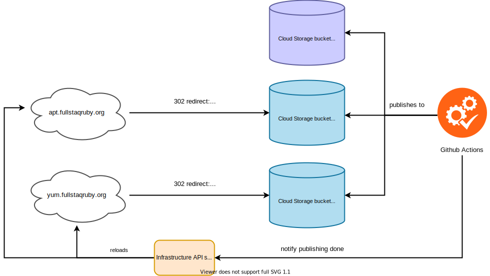

# APT and YUM repository setup

This document describes how our APT and YUM repository are designed and set up, with what requirements and constraints they were designed, and what alternative approaches we've considered.

An APT/YUM repository is a directory with a bunch of Debian/RPM package files, plus a bunch of repository metadata files. Unlike for example container registries, serving an APT/YUM repository requires no dynamic server processing. An APT/YUM repository can be served as just a bunch of static files by any web server.

While conceptually simple, publishing a repository is actually devilishly difficult because there is a lack of good tooling and good documentation, and because there are many caveats.

## Requirements and caveats addressed

Our design was made with the following requirements in mind, and addresses the following caveats:

 - **Atomic publishing** — When publishing new packages, all packages and all repository metadata updates are published as a single atomic unit: they all become visible at the same time, or if they fail, none of them become visible. This is important because:

    * Some packages depend on others, and publishing packages non-atomically can result in a window in which users are unable to install packages due to missing dependencies.
    * Metadata consists of multiple files with cross-references to each other. If their contents don't match, then the APT/YUM client will abort with error messages complaining about repository corruption.

   We implement atomicity by storing data in a versioned, immutable manner.

   See also: [Fixing APT Hash Sum Mismatch: Consistent APT Repositories](https://blog.packagecloud.io/eng/2016/09/27/fixing-apt-hash-sum-mismatch-consistent-apt-repositories/)

 - **Strong consistency** — Right after publishing new packages to the repositories, we must be able to read those new packages. This is especially important for CI tests, where we publish to a repository and then test downloading from the repository.

   We implement this by:

    - Storing data in a strongly consistent data store.
    - Waiting until all infrastructure components have acknowledged the existance of new packages, before acknowledging that publishing has completed.

 - **Concurrency safe publishing** — Multiple CI/CD runs may publish packages concurrently. This must not cause corruption or data loss.

   We implement this by [synchronizing CI/CD runs on a distributed lock](#locking), so that only one CI run may publish at the same time.

 - **Segregated, temporary repositories for testing** — Multiple CI/CD runs may test packages concurrently. Each of these runs expect the repository that they're testing against, to be in a certain state. Therefore, we want each CI run to operate against its own, segregated, temporary repository. We need the ability to quickly create a new repository at the beginning of a CI run, and to quickly destroy that repository at the end of the run.

 - **Production data parity during testing** — During CI runs we want to test the effect of publishing to production, without actually touching production. We do so by publishing to a copy repository that contains the same data as production.

 - **Preservation of old package versions** — Old package versions must be retained and must be downloadable indefinitely.

 - **Optional overwrite protection** — Existing packages in production should be considered immutable and indefinitely cacheable. Many APT/YUM tools depend on this property. So if a package already exists in the production repository, then we usually don't want to overwrite it.

   But sometimes we do, for example because an older version is corrupt. We must be able to turn overwrite protection on or off depending on the situation.

 - **Backups** — We must have periodic backups to allow for recovering from data loss, accidental corruptions and security breaches.

## Infrastructure

We self-host our repositories: we store them in Google Cloud Storage buckets. [Google Cloud Storage is strongly consistent.](https://cloud.google.com/storage/docs/consistency)

There are three buckets:

 - `fullstaq-ruby-server-edition-apt-repo` stores the production APT repository.
 - `fullstaq-ruby-server-edition-yum-repo` stores the production YUM repository.
 - `fullstaq-ruby-server-edition-ci-artifacts` stores the temporary repositories created during CI runs.

We don't let users use the production bucket URLs directly. Instead, we let users use `https://apt.fullstaqruby.org` and `https://yum.fullstaqruby.org`. These domains redirect to the appropriate bucket URLs. We do this so that we avoid strongly coupling users with Google Cloud Storage. If in the future we want to move off Google Cloud, we can do so without breaking users' URLs.

For some historical perspective, consider the fact that we used to host our packages on Bintray. In early 2021, JFrog sunsetted Bintray. Because users only used `https://{apt,yum}.fullstaqruby.org`, we were able to [migrate away from Bintray](https://github.com/fullstaq-labs/fullstaq-ruby-server-edition/issues/70) without breaking users' URLs and without downtime.

The web servers do not proxy data. Instead, they perform HTTP 302 redirects. This allows us to save on latency and bandwidth. HTTP 302 redirects are compatible with the APT and YUM clients in all distributions that we support. Very old versions of APT (for example, Ubuntu 12.04) didn't support redirects, but we don't care about that.

## Deployment strategy

Our CI/CD pipeline generates repository metadata files, using [Aptly](https://www.aptly.info/) (for APT) and [createrepo](https://linux.die.net/man/8/createrepo) (for YUM). The pipeline uploads the metadata files and the packages directly into Google Cloud Storage.

> We don't use [Aptly's API server mode](https://www.aptly.info/doc/api/). Instead, we use Aptly purely in its CLI mode to output repository metadata. See [Alternatives considered](#alternatives-considered) to learn why.

Every time the pipeline uploads new packages, it notifies the web server of the fact that changes have been made. The pipeline does so by calling the [infrastructure API server](https://github.com/fullstaq-labs/fullstaq-ruby-infra/tree/main/apiserver).

In order to ensure strong consistency, the call to the infrastructure API server does not return until the web server has actually restarted.

### No repository API server

This strategy of writing directly to a storage space, is very different from the approach usually found in package hosting services. If we look at for example Bintray, [PackageCloud](https://packagecloud.io/) and container registries, then we find that they don't allow clients direct access to the underlying storage. Instead, clients upload packages to an API server, which performs authentication, authorization and validation.

We chose not to do so because directly writing to a storage space is simpler to implement, and involves fewer infrastructure components.

One big challenge with writing directly to storage (as opposed to uploading to an API server) is making the writes concurrency-safe. We do so by [using distributed locks](#locking).

Directly writing to storage also means that we need to be very careful when writing our publishing code. After all, there is no server which performs data validation. In theory, our publishing code could overwrite or corrupt old packages. This is why changes to the publishing scripts must be carefully reviewed.

## Cloud Storage directory structure and versioning

The data in Google Cloud Storage is versioned. This does not mean using Google Cloud Storage's versioning feature. Instead, we use a directory structure like this:

APT:

~~~
versions/
 |
 +-- 1/
 |   |
 |   +-- ...
 |
 +-- 2/
 |   |
 |   +-- ...
 |
 +-- 3/
 |   |
 |   +-- public/
 |   |     |
 |   |     +-- (APT repo data here)
 |   |
 |   +-- state.tar.zst
 |   |
 |   +-- version.txt
 |
 +-- latest_version.txt
~~~

YUM:

~~~
versions/
 |
 +-- 1/
 |   |
 |   +-- ...
 |
 +-- 2/
 |   |
 |   +-- ...
 |
 +-- 3/
 |   |
 |   +-- public/
 |   |     |
 |   |     +-- (YUM repo data here)
 |   |
 |   +-- version.txt
 |
 +-- latest_version.txt
~~~

Every time the CI/CD pipeline publishes new packages, it downloads the latest version's repository data, adds new packages, then uploads the modified repository as a new version.

This approach also allows atomically publishing multiple packages.

`/latest_version.txt` contains the latest version number. The web server (`{apt,yum}.fullstaqruby.org`) reads its contents during startup in order to determine which Google Cloud Storage directory to redirect to. This is why we need to restart the web server every time we publish a new version.

A downside of this versioning approach is that each version consumes a lot of space. For now, this is not a problem because cloud storage is cheap enough. [There's a todo item to garbage collect older repository versions.](https://github.com/fullstaq-labs/fullstaq-ruby-server-edition/issues/77)

### CI bucket

During CI runs, we create temporary repositories in `gs://fullstaq-ruby-server-edition-ci-artifacts/$CI_RUN_NUMBER/{apt,yum}-repo`. These directories look as follows:

~~~
/$CI_RUN_NUMBER/{apt,yum}-repo/
  |
  +-- versions/
        |
        +-- singleton/
        |     |
        |     +-- (version data here)
        |
        +-- latest_version.txt
~~~

These directories are very similar to the production buckets' contents. But there is only a single version (which we overwrite upon CI re-runs). So we don't bother with version numbers here: we just call that single version "singleton".

The CI tests run directly against this bucket URL instead of going through `https://{apt,yum}.fullstaqruby.org`.

We create a temporary repository by copying over `gs://fullstaq-ruby-server-edition-{apt,yum}-repo/versions/$LATEST_VERSION`. This way we achieve production data parity during testing.

## Locking

We use a distributed lock to ensure that only one CI run can publish to production repositories at the same time. [The distributed locking algorithm is based on Google Cloud Storage](https://www.joyfulbikeshedding.com/blog/2021-05-19-robust-distributed-locking-algorithm-based-on-google-cloud-storage.html), and thus requires no extra infrastructure. The algorithm is robust enough to automatically recovery from crashes, so the lock itself requires no maintenance.

The algorithm that we use is slightly different from (and less sophisticated than) the one described in the article, because our implementation predates the article. But the base algorithm is still very similar.

The lock's critical section is quite large, and covers:

 * Downloading an existing repository version.
 * Modifying the repository data.
 * Uploading a new repository version.
 * Restarting the web server and waiting for that to finish.

The locks are located in the following URLs:

 * `gs://fullstaq-ruby-server-edition-apt-repo/locks/apt`
 * `gs://fullstaq-ruby-server-edition-yum-repo/locks/yum`

When publishing to a testing repository (in `fullstaq-ruby-server-edition-ci-artifacts`) we don't perform any locking, because each CI run is guaranteed to write to its own temporary repository.

## Backups

Because a version is never modified, and only new versions are added, the directory versioning scheme is automatically also a backup scheme. However this has some limitations:

 - It does not protect against someone accidentally deleting or corrupting the entire bucket.
 - It does not protect against security breaches. An attacker *could* gain write access to the entire bucket and could modify old versions.

[There's an issue open](https://github.com/fullstaq-labs/fullstaq-ruby-infra/issues/10) to address this in the future.

## Sometimes the web server needs manual restart

If the package publishing process crashes after having uploaded a new repository version, but before having finished restarting the web server, then the web server needs to be restarted manually in order to make it serve the latest repository version. Contact the [infrastructure team](https://github.com/fullstaq-labs/fullstaq-ruby-infra) to request a manual restart.

## Alternatives considered

We considered the following alternatives:

 * [Github Packages](https://github.com/features/packages) — Does not support Debian and RPM packages.
 * [Google Artifact Registry](https://cloud.google.com/artifact-registry) — Does not support Debian and RPM packages.
 * [PackageCloud](https://packagecloud.io/) — Does not allow atomic publishing. Hard to implement production data parity during testing.
 * [Reprepro](https://wikitech.wikimedia.org/wiki/Reprepro) — Does not allow atomic publishing. Very picky overwrite protection that's hard to turn off. Hard to implement production data parity during testing. Unfriendly CLI.
 * [Aptly's API server mode](https://www.aptly.info/doc/api/) (as opposed to using Aptly purely as a CLI tool) — Does not allow atomic publishing. Hard to implement production data parity during testing. Only solves half of the problem: what about YUM?
 * [Pulp](https://pulpproject.org/) — Looks difficult to set up and to use.
