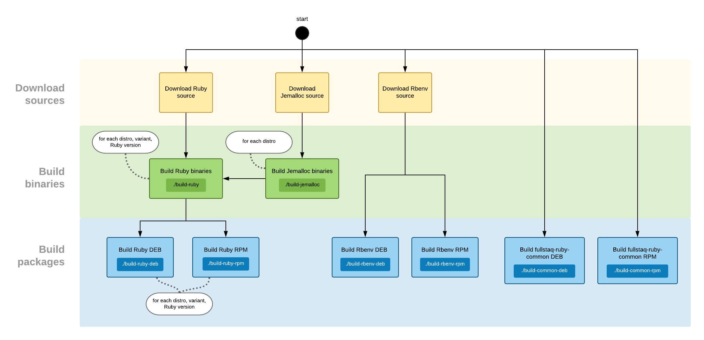

# Building packages locally

This tutorial shows how you can build packages on your own computer.

Because we follow [the "minimal dependencies" principle](minimal-dependencies-principle.md), you can build packages for any distribution, regardless of which OS or distribution you're running on.

We're going to follow the flow as described in [Build steps](build-steps.md). See [Package organization](package-organization) to learn what all the different packages do.

**Table of contents**

 * [Prerequisites](#prerequisites)
 * [Step 1: Download source code](#step-1-download-source-code)
 * [Step 2: Build Jemalloc binaries (optional)](#step-2-build-jemalloc-binaries-optional)
 * [Step 3: Build Ruby binaries](#step-3-build-ruby-binaries)
   - [With Jemalloc](#with-jemalloc)
   - [Without Jemalloc](#without-jemalloc)
 * [Step 4: Build Ruby package](#step-4-build-ruby-package)
   - [Producing a Debian package](#producing-a-debian-package)
   - [Producing an RPM package](#producing-an-rpm-package)
 * [Step 5: Build Rbenv package](#step-5-build-rbenv-package)
   - [Producing a Debian package](#producing-a-debian-package-1)
   - [Producing an RPM package](#producing-an-rpm-package-1)
 * [Step 6: Build 'common' package](#step-6-build--common-package)
   - [Producing a Debian package](#producing-a-debian-package-2)
   - [Producing an RPM package](#producing-an-rpm-package-2)
 * [Conclusion](#conclusion)
   - [Next step](#next-step)

## Prerequisites

Make sure you've [set up the development environment](dev-environment-setup.md) and that you've cloned the Fullstaq Ruby repository:

~~~bash
git clone https://github.com/fullstaq-ruby/server-edition.git
cd fullstaq-ruby-server-edition
~~~

## Step 1: Download source code

Download the following source code:

 * [Ruby](https://www.ruby-lang.org). Choose whatever version you want.
 * [Our fork of Rbenv, with support for system-wide Rubies](https://github.com/fullstaq-labs/fullstaq-rbenv)
 * [Jemalloc](http://jemalloc.net/), if you intend to build the Jemalloc variant of Fullstaq Ruby. Download version **3.x only**. Newer versions of Jemalloc are [not recommended](../README.md#vs-ld_preloading-jemalloc-yourself).

For example:

~~~bash
curl -fLO https://cache.ruby-lang.org/pub/ruby/3.1/ruby-3.1.2.tar.gz
git clone https://github.com/fullstaq-labs/fullstaq-rbenv.git

# Only run the following if you intend to build the
# Jemalloc variant of Fullstaq Ruby:
curl -fLO https://github.com/jemalloc/jemalloc/releases/download/3.6.0/jemalloc-3.6.0.tar.bz2
~~~

## Step 2: Build Jemalloc binaries (optional)

If you intend to build the Jemalloc variant of Fullstaq Ruby, then follow this step. Otherwise, skip to step 3.

Run the `build-jemalloc` script to compile Jemalloc. Example invocation:

~~~bash
./build-jemalloc \
  -n centos-8 \
  -s jemalloc-3.6.0.tar.bz2 \
  -o jemalloc-bin.tar.gz \
  -j 2
~~~

Here's what the parameters mean:

 * `-n` — the distribution you want to build for. You can see a list of distribution names by running `./build-jemalloc -h`.
 * `-s` — path to the Jemalloc source tarball, in tar.bz2 format.
 * `-o` — path to write the resulting binary tarball to, in tar.gz format.
 * `-j` — number of concurrent compiler invocations. Set this to equal the number of CPU cores, in order to speed up the compilation.

## Step 3: Build Ruby binaries

Run the `build-ruby` script to compile Ruby.

### With Jemalloc

If you intend to build the Jemalloc variant of Fullstaq Ruby, then this script requires as input the Jemalloc binary tarball produced by step 2. Example invocation:

~~~bash
./build-ruby \
  -n centos-8 \
  -s ruby-3.1.2.tar.gz \
  -v 3.1.2 \
  -o ruby-bin.tar.gz \
  -m jemalloc-bin.tar.gz \
  -j 2
~~~

Here's what the parameters mean:

 * `-n` — the distribution you want to build for. You can see a list of distribution names by running `./build-ruby -h`.
 * `-s` — path to the Ruby source tarball, in tar.gz format.
 * `-v` — the version number for this Ruby package that you would like to see in `rbenv versions`. In this example, we picked a number that's the exact same as the Ruby version number. But when you're building a minor version package, then you omit the tiny version number, and specify `3.1`.
 * `-o` — path to write the resulting binary tarball to, in tar.gz format. This tarball includes everything that's needed to produce the eventual Ruby package.
 * `-m` — path to the Jemalloc binary tarball, as produced by step 2.
 * `-j` — number of concurrent compiler invocations. Set this to equal the number of CPU cores, in order to speed up the compilation.

### Without Jemalloc

If you want to build without Jemalloc, then the invocation is basically the same, except that you don't pass `-m`. Instead, you pass `-t` if you want to build with `malloc_trim` support.

Example invocation with `malloc_trim` support:

~~~bash
./build-ruby \
  -n centos-8 \
  -s ruby-3.1.2.tar.gz \
  -v 3.1.2 \
  -o ruby-bin.tar.gz \
  -t \
  -j 2
~~~

Example invocation _without_ `malloc_trim` (and also without Jemalloc) support:

~~~bash
./build-ruby \
  -n centos-8 \
  -s ruby-3.1.2.tar.gz \
  -v 3.1.2 \
  -o ruby-bin.tar.gz \
  -j 2
~~~

## Step 4: Build Ruby package

### Producing a Debian package

Run the `build-ruby-deb` script. Example invocation:

~~~bash
./build-ruby-deb \
  -b ruby-bin.tar.gz \
  -o fullstaq-ruby-3.1.2-jemalloc_0-debian-11_amd64.deb
~~~

What the parameters mean:

 * `-b` — path to the Ruby binary tarball, as produced by step 3.
 * `-o` — path to write the resulting .deb to. You should modify the filename according to the distribution and variant that you're building for.

### Producing an RPM package

Run the `build-ruby-rpm` script. Example invocation:

~~~bash
./build-ruby-rpm \
  -b ruby-bin.tar.gz \
  -o fullstaq-ruby-3.1.2-jemalloc-rev0-centos8.x86_64.rpm
~~~

What the parameters mean:

 * `-b` — path to the Ruby binary tarball, as produced by step 3.
 * `-o` — path to write the resulting RPM to. You should modify the filename according to the distribution and variant that you're building for.

## Step 5: Build Rbenv package

### Producing a Debian package

Run the `build-rbenv-deb` script. Example invocation:

~~~bash
./build-rbenv-deb \
  -s fullstaq-rbenv \
  -o fullstaq-rbenv_1.1.2-16-0_all.deb \
  -n 1.1.2-16
~~~

What the parameters mean:

 * `-s` — path to the fullstaq-rbenv source directory, as cloned in step 1.
 * `-o` — path to write the resulting .deb to. You should modify the filename according to the actual fullstaq-rbenv version number.
 * `-n` — Rbenv version number without commit suffix. Find out by running: `/path-to-rbenv-source/bin/rbenv --version | awk '{ print $2 }' | sed -E 's/(.+)-.*/\1/'`

### Producing an RPM package

Run the `build-rbenv-rpm` script. Example invocation:

~~~bash
./build-rbenv-rpm \
  -s fullstaq-rbenv \
  -o fullstaq-rbenv-1.1.2-16-0.noarch.rpm \
  -n 1.1.2-16
~~~

What the parameters mean:

 * `-s` — path to the fullstaq-rbenv source directory, as cloned in step 1.
 * `-o` — path to write the resulting RPM to. You should modify the filename according to the actual fullstaq-rbenv version number.
 * `-n` — Rbenv version number without commit suffix. Find out by running: `/path-to-rbenv-source/bin/rbenv --version | awk '{ print $2 }' | sed -E 's/(.+)-.*/\1/'`

## Step 6: Build 'common' package

### Producing a Debian package

Run the `build-common-deb` script. Example invocation:

~~~bash
./build-common-deb -o fullstaq-ruby-common_1.0-0_all.deb
~~~

### Producing an RPM package

Run the `build-common-rpm` script. Example invocation:

~~~bash
./build-common-rpm -o fullstaq-ruby-common-1.0-0.noarch.rpm
~~~

## Conclusion

Congratulations! You've now built three packages:

 * `fullstaq-ruby-XXX`
 * `fullstaq-rbenv`
 * `fullstaq-ruby-common`

For a refresher on what these packages do, see [Package organization](package-organization.md).

### Next step

Run some tests against the produced packages: [Testing packages locally](testing-packages-locally.md)
