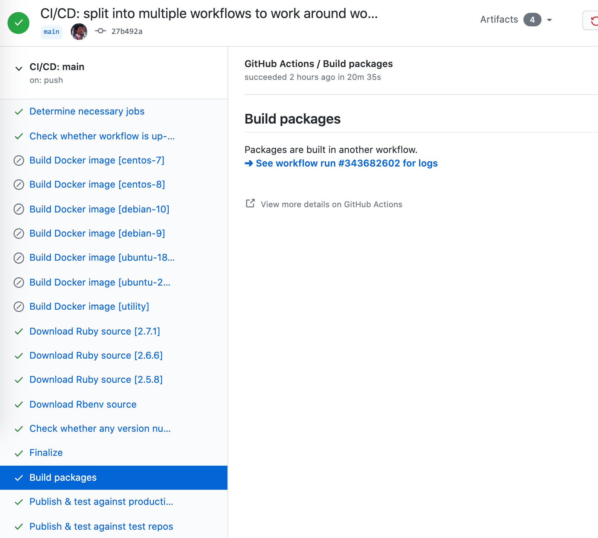

# CI/CD system and splitting into multiple workflows

Our CI/CD system -- implemented in `.github/workflows/ci-cd-*.yml.erb` -- consists of multiple Github Actions workflow files. This page explains why this is the case, how multiple workflows orchestrate amongst each other, and caveats that exist.

## Rationale

Our CI/CD system used to consist of only a single workflow file. However, because the number of build jobs and build step [increases exponentially with the number of supported distributions, Ruby versions and variants](build-workflow-management.md), the workflow file's size also grows exponentially. At some point we [ran into undocumented, unofficial Github Actions limits](https://github.com/fullstaq-ruby/server-edition/issues/62). These limits are related to the number of jobs, the number of steps, and it seems even the workflow file size. Running into these limits results in strange errors, such as failed CI runs without error messages, or even YAML parsing failures due to truncated input.

After talking to a Github Actions product owner, it was clear that this issue wouldn't be solved any time soon. After [evaluating our options](https://github.com/fullstaq-ruby/server-edition/issues/62#issuecomment-704746817), it was decided that splitting the CI/CD system into multiple workflows was [the best alternative](https://github.com/fullstaq-ruby/server-edition/issues/62#issuecomment-707610620).

## Orchestration

The CI/CD system calls the workflows in the following order:

 1. CI/CD: main (`ci-cd-main`)
 2. CI/CD: build packages (`ci-cd-build-packages`)
 3. CI/CD: publish & test against test repos (`ci-cd-publish-test-test`)
 4. CI/CD: publish & test against production repos (`ci-cd-publish-test-production`)

"Main" is triggered by a Git push. All subsequent workflows are triggered by the previous workflow. That is, 1 triggers 2 upon successful completion, 2 triggers 3 upon successful completion, etc.

Triggering the next workflow works via the [Github Actions workflow dispatch API](https://docs.github.com/en/free-pro-team@latest/actions/managing-workflow-runs/manually-running-a-workflow). Triggering is not done via the Github Action's `GITHUB_TOKEN`, because they specifically [disallow that token from being used for triggering workflows](https://docs.github.com/en/free-pro-team@latest/actions/reference/events-that-trigger-workflows#triggering-new-workflows-using-a-personal-access-token). Instead, triggering is done via a bot account's (`fullstaq-ruby-ci-bot`) Personal Access Token. This bot account is managed by [the infrastructure team](https://github.com/fullstaq-labs/fullstaq-ruby-infra).

When triggering the next workflow, we pass along the "Main" workflow's CI run number. This allows all workflows to share CI artifacts with each other. After all, CI artifacts are [stored in Google Cloud Storage](ci-cd-resumption.md) and are namespaced by the CI run number.

## Special considerations

### Additional checks & correlating workflow runs

We want _all_ workflows to show up in a commit's or a pull request's list of checks. This doesn't happen naturally: only the "Main" workflow is triggered by a Git push, and all other workflows are triggered via the API, so Github normally has no way of knowing that all the other workflows are related.

We use the [Github Checks API](https://docs.github.com/en/free-pro-team@latest/rest/reference/checks) in order to allow all workflows' statuses to show up in the list of checks. A workflow creates a check for the next workflow, and the next workflow (upon completion) updates its status.

You can see these checks in the Github Actions UI in the left sidebar:

When you view a "Main" workflow run, you can see that it has created checks for the "Build packages" and the "Publish & test" workflows.

When you view the details of that check, it links to the actual workflow run that's associated with that checks.

### "CI/CD: build packages" being too big

The "CI/CD: build packages" stage — even on its own — can grow so quickly that a single "CI/CD: build packages" workflow file can easily exceed the Github Actions size limit. So we split this stage further into a fixed number of subparts (`ci-cd-build-packages-X.yml`). Each subpart builds only for a subset of all supported distributions.

All subparts run concurrently. The last subpart that finishes, triggers the next stage ("CI/CD: publish & test against test repos"). This works by having each subpart's "Finalize" job atomically increment a counter. The subpart that succeeds in incrementing the counter to a value that's >= the number of subparts, recognizes itself as the last subpart that has finished.

### New `workflow_dispatch` workflows introduced into a non-main branch, aren't immediately recognized by Github Actions

If we introduce new workflows that are only triggered through the `workflow_dispatch` event, then those workflows are only immediately recognized by Github Actions if we push them to the main branch. This causes some headache when we want to test new workflows outside the main branch, because new workflows can't be triggered yet (neither through the UI nor through the API).

We work around this problem as follows:

 1. We allow all `workflow_dispatch`-able workflows to be triggered through `push` events as well, but only when pushing to the `fix/cicd-new-workflows` branch.

   ~~~yaml
   on:
   workflow_dispatch:
     ...
   push:
     branches:
       - fix/cicd-new-workflows
   ~~~

 2. We force Github Actions to detect new workflows, by pushing our work to the `fix/cicd-new-workflows` branch.

 3. Github Actions will trigger all workflows simultaneously. They will also abort early, which is okay: we ignore these errors.

    The `fix/cicd-new-workflows` branch's only purpose is to force Github Actions to detect new workflows: it's not supposed to do anything else. Therefore the workflows contain a step that abort the workflow upon detecting that it's running on the `fix/cicd-new-workflows` branch:

    ~~~yaml
    jobs:
      determine_necessary_jobs:
        ...
        steps:
          - name: Workaround for detecting new workflows in branches
            run: |
              echo 'New workflow detected. Please delete the fix/cicd-new-workflows branch now.'
              exit 1
            if: github.event_name == 'push'
    ~~~

    After Github Actions has detected the new workflows, we can delete the `fix/cicd-new-workflows` branch.

### Re-running a workflow run that's no longer the branch head

Github Actions allows you to re-run an older workflow run. That run may be associated with a commit that's no longer the head of the branch. This creates a complication with the way we trigger subsequent workflows.

The workflow dispatch API (which we use to trigger subsequent workflows) only allows triggering a workflow based on the head of a given branch. It's not possible to trigger a workflow based on a specific commit.

This means that one has to be careful when re-running a workflow run whose commit is no longer the head of the branch. It could result in triggering subsequent workflows that are incompatible with the commit.
