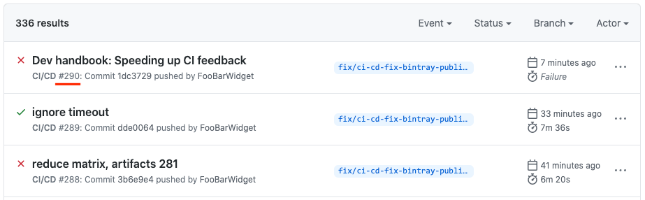

# Speeding up CI feedback

Our Github Actions-based CI/CD system performs [a lot of work](build-workflow-management.md), and takes \~45 minutes per run. During development, you may want to get faster CI feedback. This can be achieved through two tricks:

 1. Temporarily reducing the number of combinations.
 2. Temporarily reusing a previous CI run's artifacts.

The emphasis is on *temporary*: these tricks may only be enabled during development, and must be disabled before submitting a pull request or merging to main.

## Reducing the number of combinations

Edit config.yml and get rid of all the Ruby versions, variants and distributions that you don't want the CI to test. For example, when upgrading Ruby 2.7.1 to Ruby 2.7.2, change this...

~~~yaml
ruby:
  minor_version_packages:
    - minor_version: 2.7
      full_version: 2.7.1
      package_revision: 2
    - minor_version: 2.6
      full_version: 2.6.6
      package_revision: 6
    - minor_version: 2.5
      full_version: 2.5.8
      package_revision: 5

  tiny_version_packages:
    - full_version: 2.7.1
      package_revision: 1
    - full_version: 2.6.6
      package_revision: 2
    - full_version: 2.5.8
      package_revision: 2
~~~

...to this:

~~~yaml
ruby:
  minor_version_packages:
    - minor_version: 2.7
      full_version: 2.7.2
      package_revision: 3

  tiny_version_packages:
    - full_version: 2.7.2
      package_revision: 1
~~~

And:

~~~
# Test only jemalloc variant for now
variants:
  normal: false
  jemalloc: true
  malloctrim: false

# Test a random DEB and RPM distribution
distributions:
  - debian-10
  - centos-8
~~~

## Reusing a previous CI run's artifacts

You can tell the CI to behave as if it's running as a previous CI run. Because of [CI/CD system resumption support](ci-cd-resumption.md), the CI will skip the jobs for which the associated artifacts have already been built.

You can find the CI run number in the Github Actions CI run listing, right below the commit message:

Open .gitub/workflows/ci-cd.yml.erb. Go to the `env` section, and set `CI_ARTIFACTS_RUN_NUMBER` to the CI number for which the artifacts you want to reuse. For example:

~~~yaml
env:
  ...
  CI_ARTIFACTS_RUN_NUMBER: 290
~~~

## Don't commit these changes

The tricks described in this document are supposed to be temporary. Don't commit them into your pull request, or into the main branch.
